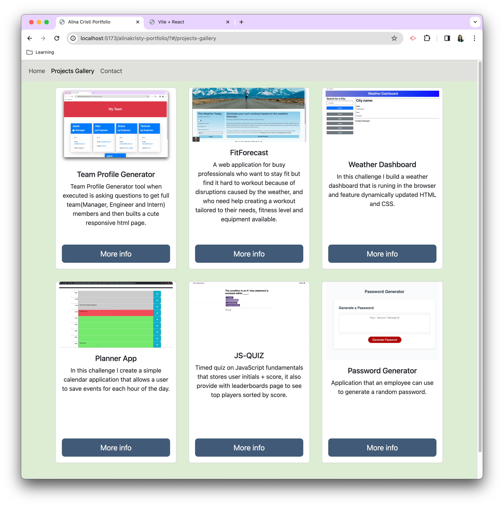
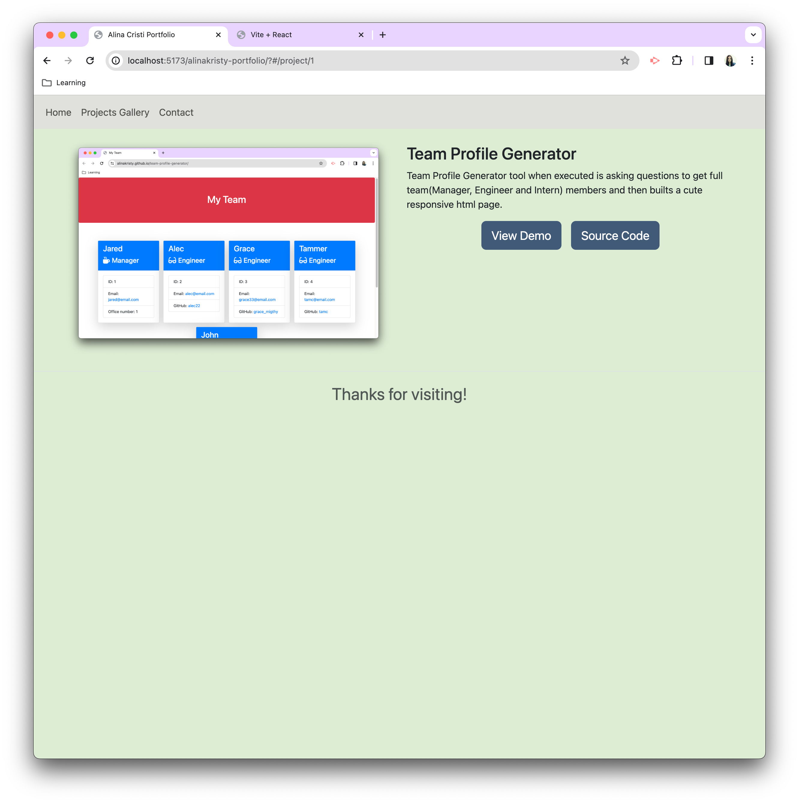
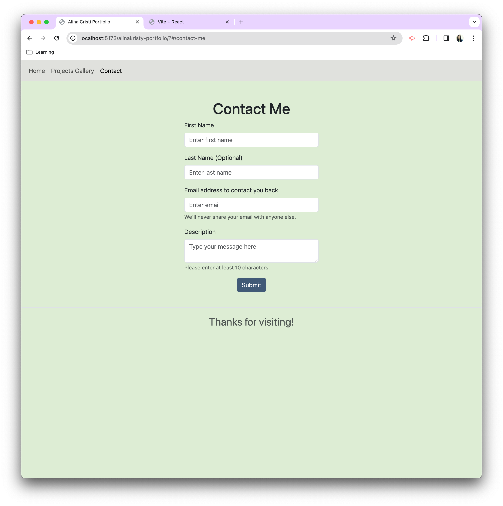

# alinakristy-portfolio

[](https://opensource.org/licenses/MIT)

My personal portfolio website using react+vite+bootstrap

## Table of Contents 
- [Installation](#installation)
- [Usage](#usage)
- [Contributing](#contributing)
- [Tests](#tests)
- [Result](#result)
- [React and Vite](#react-and-vite)
- [Deployment](#deployment)
- [Live URL](#live-url)
- [Questions](#questions)
- [License](#license)
- [Extras](#extras)

## Installation 
- `npm install`

## Usage 
- `npm run dev`

## Contributing 
No contribution guideline provided

## Tests
```N/A```

## Result

Image 1:


Image 2:


Image 3:


Image 4:


## React and Vite

This template provides a minimal setup to get React working in Vite with HMR and some ESLint rules.

Currently, two official plugins are available:

- [@vitejs/plugin-react](https://github.com/vitejs/vite-plugin-react/blob/main/packages/plugin-react/README.md) uses [Babel](https://babeljs.io/) for Fast Refresh
- [@vitejs/plugin-react-swc](https://github.com/vitejs/vite-plugin-react-swc) uses [SWC](https://swc.rs/) for Fast Refresh


## Deployment
Added automatic deployment using github actions following this tutorials:
- https://vitejs.dev/guide/static-deploy#github-pages
- https://www.youtube.com/watch?v=XhoWXhyuW_I

## Live URL
https://alinakristy.github.io/alinakristy-portfolio/

## Questions 
For mre information contact me via [GitHub profile](https://github.com/alinakristy) or email address <alinakristy@gmail.com>
  
## License 
This application is covered by the MIT license.

## Extras
Created by ***Alina Osipov***

***Disclaimer:*** This readme was generated by https://github.com/alinakristy/readme-application